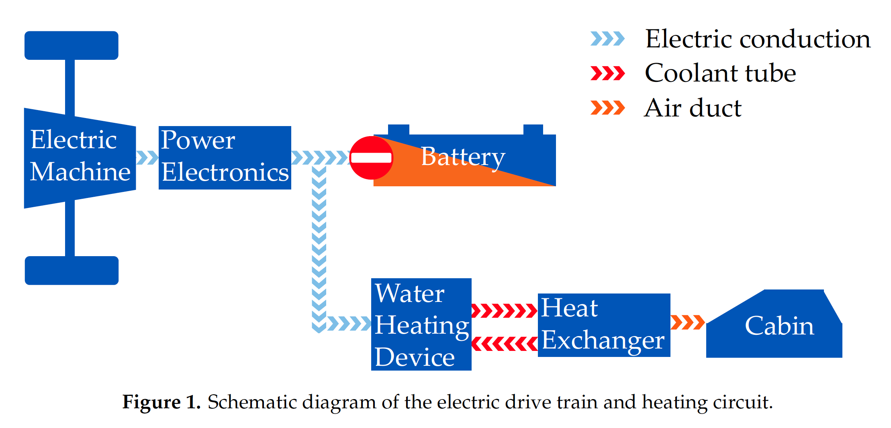
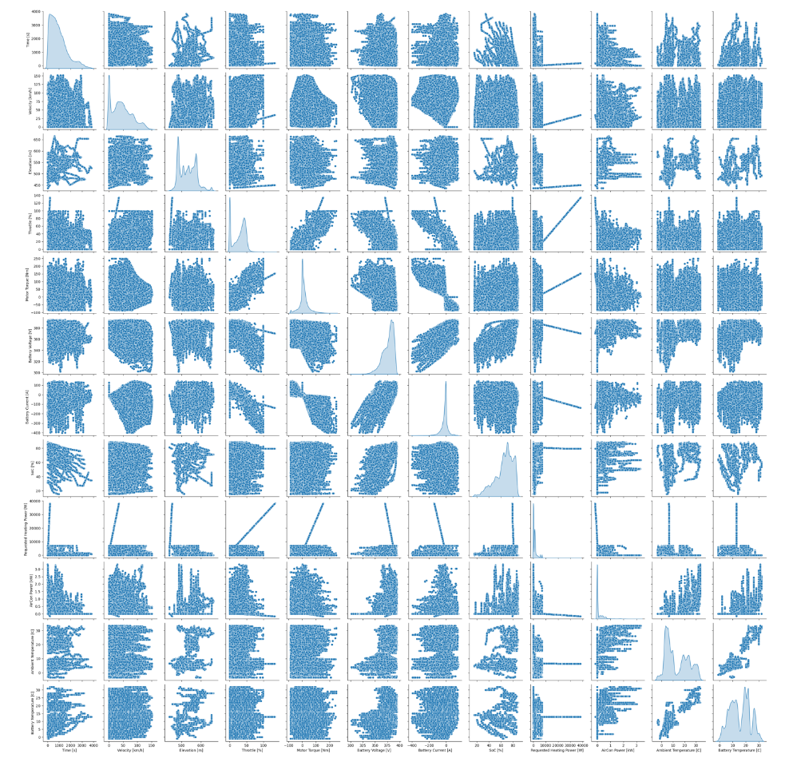

# Core Temperature Estimation of Electric Vehicle Battery Packs

## Feature Selection and Dimensionality Reduction
 

### Removal of Specially Measured Features
The goal of our project is to predict the battery temperature using only measurements that would be available to a standard vehicle control system. However, our chosen dataset contains measurements from standard vehicular instrumentation, as well as a family of specially installed, after-market sensors (installed by the researchers who generated this dataset, marked with a (*) in [Table 1](preprocessing#missing-data)). Therefore, we discarded all but one of the specially measured features (i.e., Features 28 – 48) as a first step. The exception, of course, is Feature 10 (battery temperature), which is our target variable for prediction.

 
### Removal of Unnecessary Features
Figure 1, taken from [\[8\]](references) illustrates the flow of electric power within the EV, and aids in the identification of unnecessary features. 

It is well known that battery temperature is influenced by the electrical load on the battery. In the vehicle under study, the electrical load comes from two sources: the traction motor and the heating system. It follows that measurements of voltage, current, and power at the motor and heater must be retained. While measurements of cabin, coolant and heat exchanger temperature measurements are also available, these quantities are directly related to the heater’s power consumption through the laws of thermodynamics and are therefore not necessary for prediction given the presence of measurements at the heater. Therefore, Features 24 – 27 were discarded.

<b> Figure 1: Schematic Diagram of the electric drive train and heating circuit </b>

 
### Removal of Redundant Features
The following redundant features were also identified and removed after studying the dataset:

* Feature 7 simply indicates when the traction motor is used for regenerative braking. Equivalent information is captured by Feature 5 going negative. Furthermore, eliminating Feature 7 (Boolean) results in a dataset with all real-valued variables. Therefore, Feature 7 was discarded.
* Features 11, 14, and 15 provide summaries of Features 10 and 12 (respectively) at the trip granularity and thus are not useful for predicting temperature on an instantaneous basis. Therefore, Features 11, 14, and 15 were discarded.
* Feature 13 is simply a rounded version of Feature 12 (for the driver’s convenience), and was therefore discarded.
* Features 16 and 17 are simply encoded versions of Feature 18 that are used in digital communications within the vehicle (CAN and LIN are two digital communication standards employed in electric vehicles). Therefore, Features 16 and 17 were discarded.

Further redundancies in the feature set may be revealed through an analysis of the Pearson correlation between features in the (reduced) dataset. The Pearson correlation, R, between two features measures the strength of the linear relationship between them; \|R\| close to one indicates a strong linear relationship between two features. Redundancy between features implies a strong correlation, but the converse is not necessarily true. However, additional domain knowledge can be applied to reason about redundancy, given correlation data.

| Feature 1                      | Feature 2                     | \|R\| |
| ------------------------------ | ----------------------------- | ----- |
| Heater Current                 | Requested Heating Power       | 1     |
| Longitudinal Acceleration      | Motor Torque                  | 0.96  |
| Ambient Temperature            | Battery Temperature           | 0.87  |
| Battery Voltage                | Battery State of Charge (SoC) | 0.80  |
| Battery Current                | Motor Torque                  | 0.72  |

 <b> Table 2: Pairs of Features with Strong Pearson Correlation (R≥0.7) </b> 

 
### Analysis of Table 2 reveals that:
* Heater current and power are very strongly correlated. Physically, the heater power consumption is the product of the voltage across the heater’s electrical terminals and the current drawn by the heater. Strong correlation between current and power implies that voltage is essentially constant. Therefore, Feature 21 (heater voltage) may be discarded along with Feature 22 (heater current), if Feature 23 (heater power) is retained.
* The vehicle’s longitudinal acceleration is very strongly correlated to the (traction) motor torque. This is expected, and follows from basic mechanics.  Feature 6 (acceleration) may therefore be discarded if Feature 5 (motor torque) is retained.
* Battery temperature and ambient temperature are strongly correlated. This is expected, but not indicative of any redundant measurements.
* Battery voltage and state-of-charge are strongly correlated. This is also expected, and is a well-known characteristic of lithium-ion batteries used in electric vehicles. However, the voltage-state-of-charge relationship of batteries is strongly nonlinear, so this correlation is not indicative of any redundancy.
* Battery current and motor torque are strongly correlated. If there were no heater present, battery current and motor torque would be redundant measurements (related by nearly-linear AC motor physics). However, since the heater also influences battery current, this strong correlation is not indicative of redundancy.

 
### Removal of Outliers
A pairwise scatterplot visualization of the reduced dataset suggested the presence of outliers in heater and air conditioner power signals (see Figure 2). Further inspection of the dataset revealed that indeed, for a period of about five minutes during only one trip, the power consumption values reported by the heater and air conditioner were abnormally large (and invalid, beyond the physical capabilities of the devices). This small ‘blip’ in the dataset was discarded by applying a threshold to the heater power feature. The threshold value was obtained by computing the maximum value of heater power measured on all other trips except the one containing invalid data.

<b> Figure 2: A Pairwise Scatterplot </b>

 
### Summary of Data Preprocessing
The original dataset contained 1,094,793 (partial) observations of the 48 features listed in [Table 1](preprocessing#missing-data). After (i) discarding a small amount of intermittently missing data, (ii) significant feature selection effort, and (iii) discarding a small number of outliers, the reduced dataset contains 1,040,342 complete observations of the 12 features listed in [Table 3](feature_selection#summary-of-data-preprocessing). These features would be further subjected to Principal Component Analysis further in the process.

| Number | Features                         | Units |
| ------ | -------------------------------- | ----- |
| 1      | Elapsed Time Since Start of Trip | s     |
| 2      | Vehicle Velocity                 | km/h  |
| 3      | Vehicle Elevation                | m     |
| 4      | Throttle Depression              | %     |
| 5      | Motor Torque                     | Nm    |
| 6      | Battery Voltage                  | V     |
| 7      | Battery Current                  | A     |
| 8      | Battery Temperature              | °C    |
| 9      | Battery State of Charge (SoC)    | %     |
| 10     | Requested Heating Power          | W     |
| 11     | Air Conditioner Power            | kW    |
| 12     | Ambient Temperature              | °C    |

 <b> Table 3: List of Features in Reduced Dataset 
 </b>
