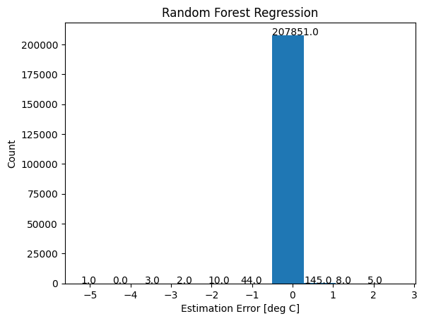
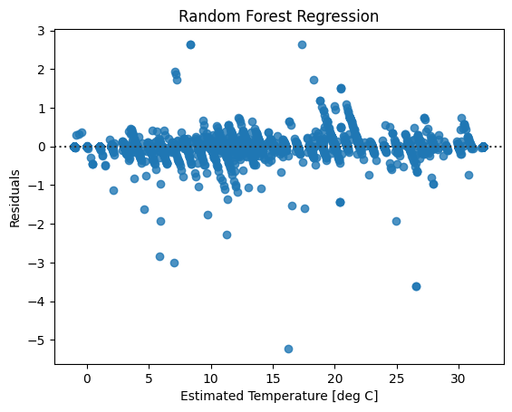
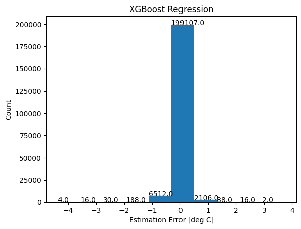
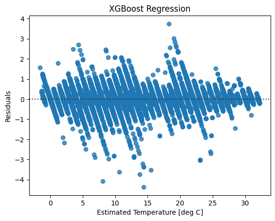

# Core Temperature Estimation of Electric Vehicle Battery Packs

## Results for Finals submission
 

### Random Forest Regression Results

* Since, we had divided the entire dataset into 80:20 (Train:Test) split with 80% of data being used to train and cross validate, only 20% of unseen datapoint was used to evaluate the model.
* [Table 4](finals_results#random-forest-regression-results) captures the evaluation metrics of interest.
* It is patent that Random Forest Regression clearly improved on all aspects when compared to the previously used models of midterm submission:
    * Mean Absolute Error of **0.002** against **1.89** of Polynomial Regression (best in the category)
    * Max Absolute Error of **5.224** against **11.45** of Polynomial Regression with l1 penality (best in the category)
    * R^2 Score and adjusted R^2 score of **99.997%** against **89.91%** of Polynomial Regression (best in the category)

| Evaluation Metric   | Score   |
| -----------------   | -----   |
| Mean Absolute Error | 0.002   |
| Max Absolute Error  | 5.224   |
| R^2 Score           | 99.997% |
| Adjusted R^2 Score  | 99.997% |

 <b> Table 4: Various Metrics of evaluation for Random Forest Regression </b> 

* Figure 16 captures the distribution of residuals of random forest regression. It can be seen that the error distributions is centered at 0 with a slightly longer left tail however with a negligibly small standard deviation.
* Further examination of Figure 16 also reveals that for the random forest regression model, the maximum absolute error corresponds to rare scenarios, displaying the robustness of the model.

 <b> Figure 16: Error Distribution of Random Forest Regression </b> 

* Figure 17 shows the residuals spread across the predicted values of battery temperature, displaying constant and small variation of errors across the predicted values.

 <b> Figure 17: Residual Plot of Random Forest Regression </b> 

### XGBoost Regression Results

* Similar to Random Forest, we have divided the entire dataset into 80:20 (Train:Test) split with 80% of data being used to train and cross validate, and 20% of unseen datapoint was used to evaluate the model.
* [Table 5](finals_results#XGBoost-regression-results) captures the evaluation metrics of interest.
* We have managed to bring some improvement on the Random Forest Regression results while using the XGBoost Regression on some key metric of Max Absolute Error.
    * Mean Absolute Error of **0.107** against **0.002** of Random Forest Regression (second-best in the category)
    * Max Absolute Error of **4.369** against **5.224** of Random Forest Regression (best in the category)
    * R^2 Score and adjusted R^2 score of **99.94%** against **99.9%** of Random Forest Regression (very similar to Random Forest Regression)

| Evaluation Metric   | Score   |
| -----------------   | -----   |
| Mean Absolute Error | 0.107   |
| Max Absolute Error  | 4.369   |
| R^2 Score           | 99.94% |
| Adjusted R^2 Score  | 99.94% |

 <b> Table 5: Various Metrics of evaluation for XGBoost Regression </b> 

* Figure 18 captures the distribution of residuals of XGBoost Regression. The error distribution is fairly centered with a marginally longer left tail and seems to be closer to normality when compared to the error distribution in Random Forest.
* Further examination of the figure also reveals that there are few instances that reach the maximum absolute error of 4, displaying the robustness of the model.

 <b> Figure 18: Error Distribution of XGBoost Regression </b> 

* Figure 19 shows the residuals spread across the predicted values of battery temperature, and we observe a constant and small variance of residual errors across different values of Estimated Temperature.

 <b> Figure 19: Residual Plot of XGBoost Regression </b> 
