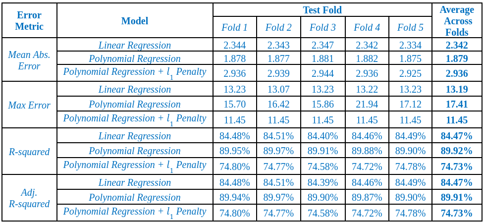
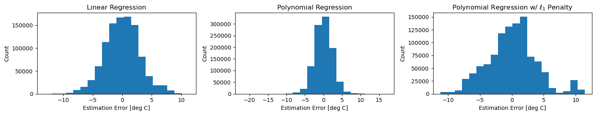
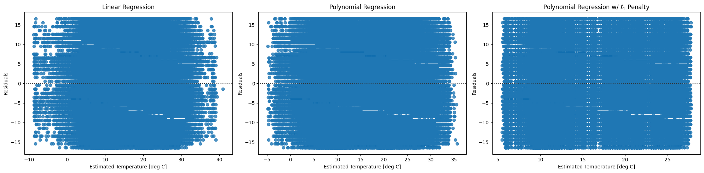
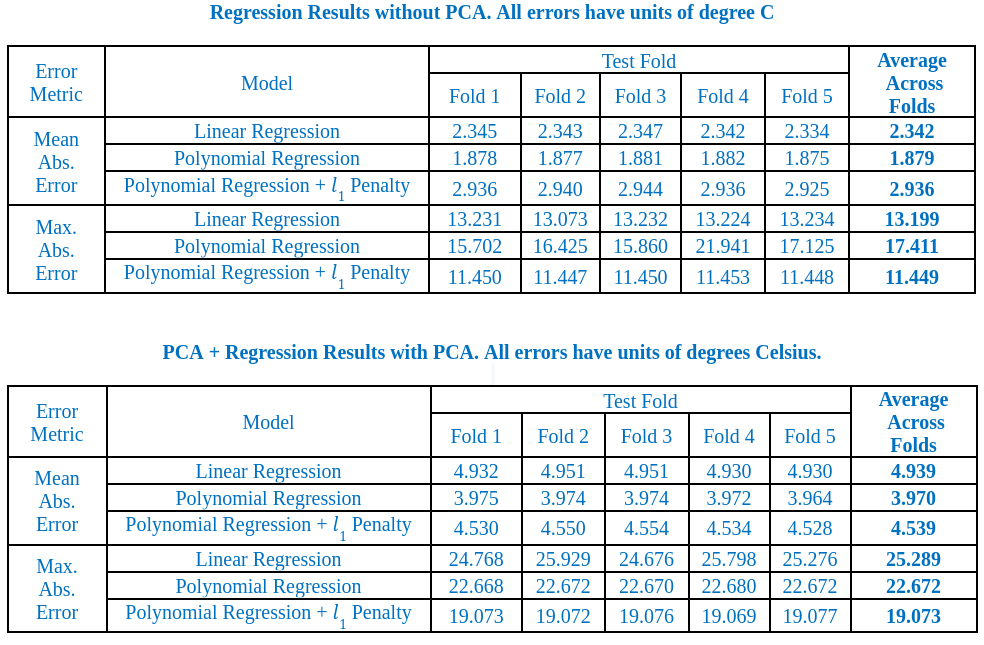

# Core Temperature Estimation of Electric Vehicle Battery Packs

## Results
 

### Regression Results
Results of performing temperature prediction using Models 1, 2 and 3 and their corresponding error analysis are presented in Figures 12-13.

* The linear regression model performed surprisingly well, with a mean absolute temperature estimation error of about 2.3 degrees Celsius (on average, across folds) and a R-squared score of about 85%.
* The polynomial regression model improved upon this mean absolute error and R-squared score, at the cost of using about 7 times more features for prediction, but simultaneously worsened the maximum absolute error, which is expected behavior for polynomial models. The increased number of features should not be a concern as the dataset has around 1 million data points and the number of feature is still well within the permissible limit (as reflected by almost no change in the adjusted R-squared score.)
* Introducing l1-regularization in the polynomial regression model yielded the lowest maximum absolute error as the model only had 4 significant features, but at the cost of mean absolute error and R-squared. As future work post-midterm, we are also planning to do hyper-parameter tuning on the L1 term (alpha) for Lasso Regression to see if we can improve the results.
* We have not included metrics like Mean absolute Percentage error in Figure 12 as the score is arbitrarily high when the actual values of temperature is close to zero.

 <b> Figure 12: Regression Results </b> 

We have the distribution of residuals for all models in Figure 13. It can be seen that the error distributions of the Linear and standard polynomial regression is fairly normal with the errors for polynomial regression slightly skewed towards right. The residuals distribution of Polynomial regression with L1 penalty does not seem to follow normal distribution.

Further examination of Figure 13 reveals that for the linear and standard polynomial regression models, the maximum absolute error corresponds to rare scenarios, and that the mean absolute error is indicative of typical estimator performance. For the regularized polynomial regression model, a cluster of poor performance is observed around +10 degrees.

 <b> Figure 13: Error Distribution </b> 

Figure 14 shows the residuals spread across the predicted values of battery temperature. The residual plot for all 3 models display constant variance of errors across the predicted values which is ideally what we want.

 <b> Figure 14: Residual Plot </b> 

### PCA Results
 Interpretation: Time is the most important predictor, followed by Requested Heating Power. Component 1 is significantly dependent on the predictor Elevation as compared to Component 2. Component 2 is more dependent on predictors Throttle, SoC, AirCon power.

 <b> Figure 15: PCA analysis </b> 

From Figure 15, we observe that there is a significant increase in the mean as well as the max absolute errors. We conclude that PCA may not work well and optimize the prediction results for models Linear Regression, Polynomial Regression and Polynomial Regression with L1 penalty. We hope to incorporate PCA in our future models to be built.