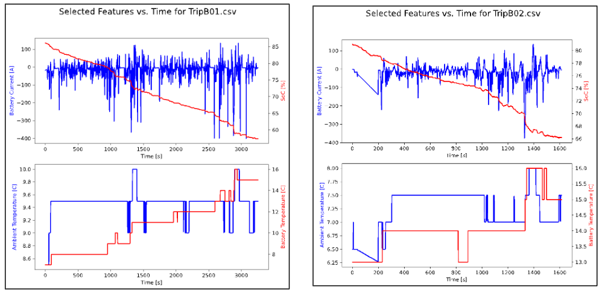
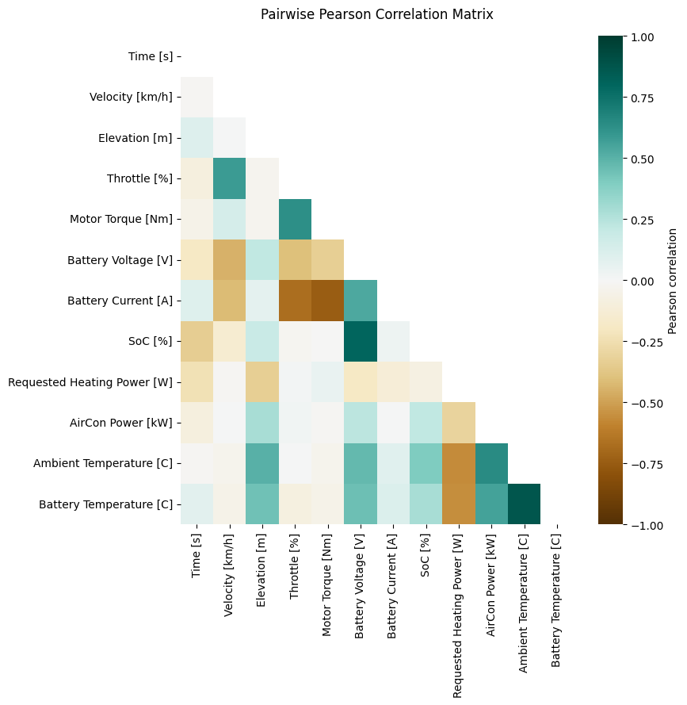
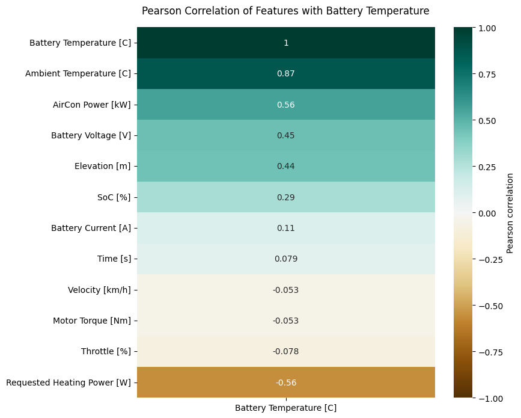
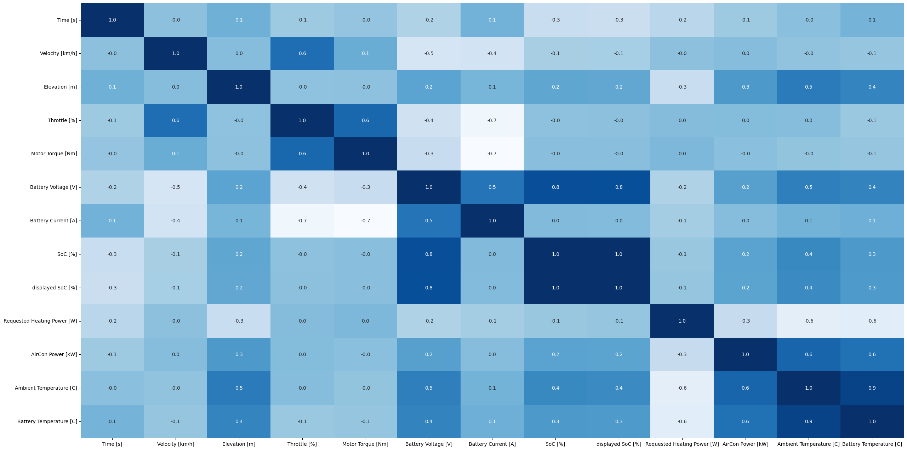
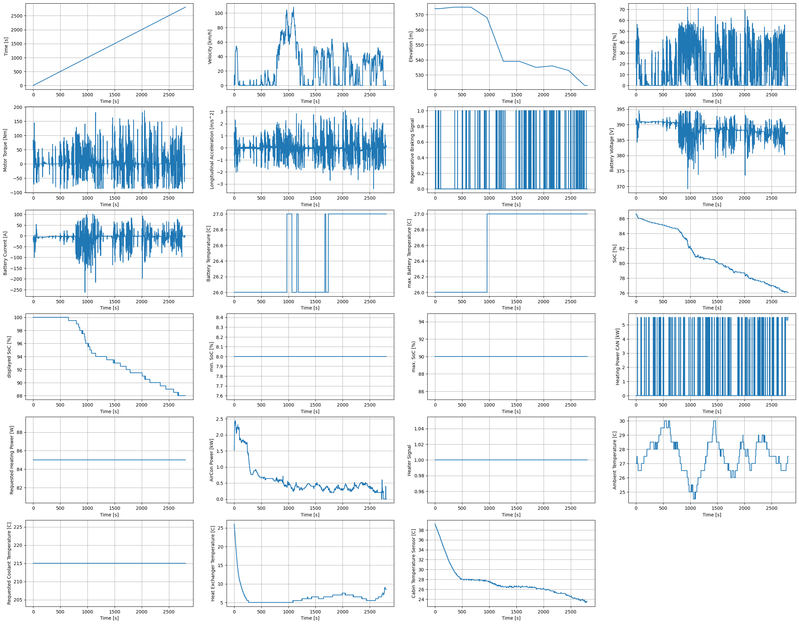
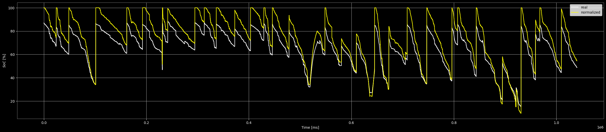
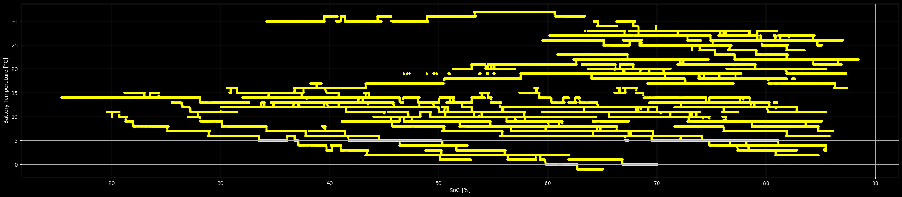
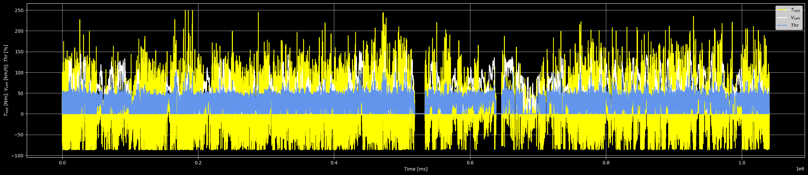

# Core Temperature Estimation of Electric Vehicle Battery Packs

## Data Visualization
 

The reduced-size dataset is amenable to visualization. Several figures are presented as following:
* Figure 3 visualizes a subset of the available features against time for two of the 72 trips in the dataset. One immediately observes that the temperature sensors used for data selection report quantized values (i.e., values that are rounded to the nearest degree). This represents a fundamental limitation (i.e., lower bound) on the estimation error that our predictive models can achieve.
 

<b> Figure 3: Plots of selected features vs. time from two of the 70 data files in the original dataset </b>

 

* Figure 4, Figure 5 and Figure 6 visualize the Pearson correlation among the features (Figure 4) and between the features and the target variable (battery temperature) (Figure 5). The strongest correlations in Figure 4 have already been discussed following [Table 2](feature_selection#summary-of-data-preprocessing). The last row of Figure 4 is reordered and presented in Figure 5 to show which features are strongly correlated with battery temperature.

<b> Figure 4: Pearson correlation between features in the reduced dataset </b>

 

* We chose to treat the regression to model instantaneous Battery Temperature [C] (target variable). This is further substantiated by the negligible correlation of relative time with the target variable as seen in Figure 5.

<b> Figure 5: Pearson correlation between features in the reduced dataset and battery temperature </b>

<b> Figure 6: HeatMap for reduced features </b>

 

* Figure 7 shows pairwise scatterplots between the features after outliers were removed (compare to Figure 2). Unlike Pearson correlation, pairwise scatterplots can reveal nonlinear relationships between features. However, the strength of a general nonlinear relationship is hard to quantify without additional assumptions on the nonlinearity (e.g. a quadratic nonlinearity), so analysis must be performed visually. Figure 6 does not show any strong pairwise relationships that are not captured in Figure 4. The scatterplots of Figure 6 each exhibit significant spread, indicating a strong coupling between features.

<b> Figure 7: Pairwise scatterplots between features in the reduced and cleaned (i.e., final) dataset </b>

 

* Figure 8 is a brief visualization for a single trip. It shows the variation of all features with respect to time depicting the changes per feature over time.

<b> Figure 8: Graphs for a single trip (TripA08) for all features vs time </b>

 

* Figure 9 is the comparison graph for the real vs the normalized SoC% which is SoC% and the displayed SoC%. The normalized or the displayed SoC values are almost always higher than the real SoC values.

<b> Figure 9: Graphs for a SOC% degradation with time for a vehicle </b>

 

* Figure 10 is the graph between the battery temperature and the SoC% values for the reduced dataset values. With increase in SoC values the battery temperature stays constant during the initial phase and then degrades over time. 

<b> Figure 10: Graphs for SOC% degradation with Battery Temp [C] for a vehicle </b>

 

* Figure 11 is a graph between the Throttle, Velocity [km/h] and the Motor Torque of a vehicle with respect to time. It can be seen that all three features have similar variations with time with similar drops and peaks.

<b> Figure 11: Graphs for Throttle, Motor Torque and Velocity with Time for a vehicle </b>

 
